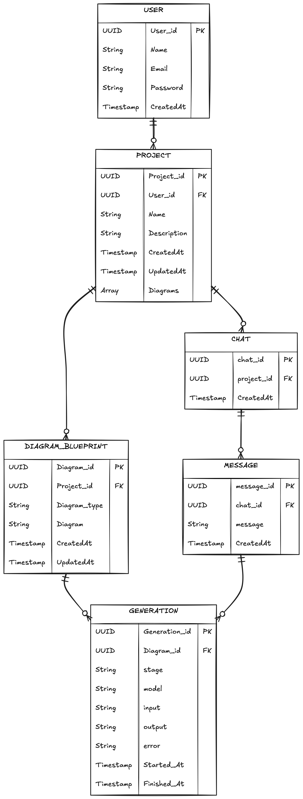

# Product Requirements Document (PRD): ArchX

## The Ideation

We create many diagrams (e.g., class, sequence, and ER diagrams) while developing a system architecture. Whenever we add a new entity or relationship, we have to draw and update the existing diagram manually, which is a time-consuming process.

Here we are with ArchX  and its AI powered tool  to build a your diagrams in seconds to create actual diagrams or blueprint of your system architecture. by understanding your requirements we will generate and update the diagrams for you. 

Or create boiler plate structure where you can edit the diagrams manually as per you project liking or requirements and techstacks

## 2. Product Vision & Goals

To create a specialized AI tool or agent to create necessary or boiler plate structures for a projects according to its requirements and techstacks 
and editor to edit the generated ones ( by the chances of hallucination or incorrect or misleading context)  to save valuable time of developers and architects and tokens 

Our goal is to reduce the overall time taken to create system architecture diagrams, save LLM API tokens, and reduce hallucination. By generating boilerplate and providing the ability to edit, we give reviewers and developers less complexity, more accuracy, and greater efficiency with the help of AI.

## Features

1. Convert user given text or prompt into structural diagrams for a project for system design as per the requirements for the system or project and techstacks .

2. allow user to edit the generated diagrams as per the requirements and save  the created structure.

3. modifying the existing diagrams for any new requirements instead of creating new diagrams to save context or llm's tokens 

## Tech Stacks (yet to be decided)

## Entity Relationship Diagrams & Data Model

Here is how our data model is structured under the hood to make the AI chat and diagram generation work smoothly. We keep things focused on six main pieces:

- **USER:** Handles authentication and owns workspaces (UUID, Name, Email, Password).
- **PROJECT:** The central folder for a specific system design. A user can create many of these.
- **DIAGRAM_BLUEPRINT:** Stores the active state and raw code (Mermaid/JSON) of the generated diagrams. A project holds multiple blueprints.
- **CHAT & MESSAGE:** Keeps track of the conversational prompt history so the AI remembers context for iterative tweaks.
- **GENERATION:** Logs the exact LLM metrics, input/output, and errors every time an AI update is triggered. This links a specific Message to a Diagram Blueprint.

### ERD Visual

The diagram below visually maps out how the six core entities interact. Notice how the `PROJECT` acts as the central pillar—it owns both the active `DIAGRAM_BLUEPRINT`s and the `CHAT` threads. Every time a `MESSAGE` triggers an AI update, a `GENERATION` record is created, bridging the gap between your conversational history and the structural code modifications.

### Class Diagrams

For a deeper dive into the system's class structure, you can reference our handwritten architectural diagrams:
- [View ArchX Class Diagrams (Current)](../assets/diagrams/ArchX%20Class%20diagrams.pdf)
- [View ArchX Class Diagrams (V0 / Initial Draft)](../assets/diagrams/ArchX%20Class%20diagrams_V0.pdf)